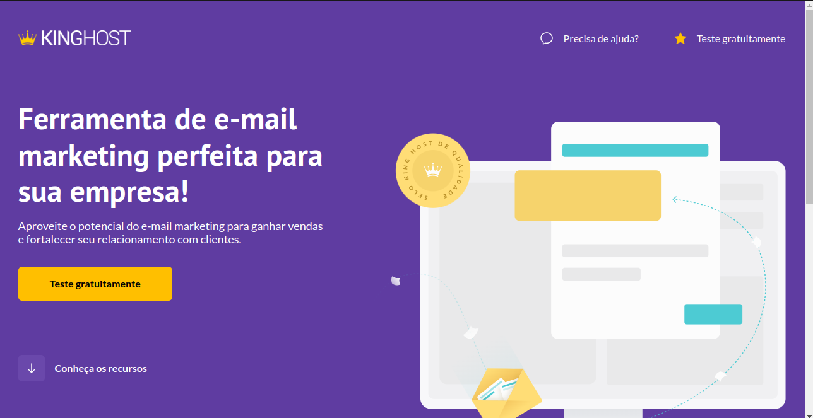
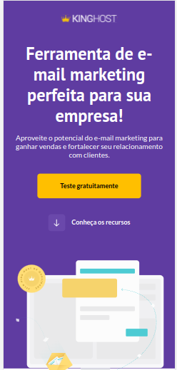
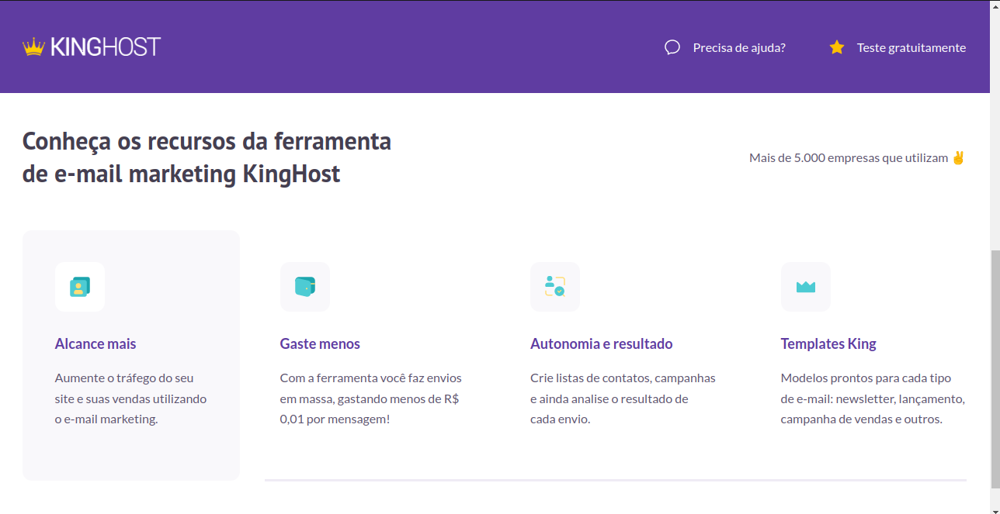

   

## Descrição do projeto 

 Projeto desenvolvido para o curso de "Front-End descomplicado" no CodeBoost. A página é uma inspiração do KingHost; utilizando práticas de HTML,CSS e SASS.

#

## Tecnologias utilizadas

 <a href="https://www.w3.org/" target="_blank">HTML</a> 
  <a href="https://www.w3.org/" target="_blank">CSS</a> 
 <a href = "https://sass-lang.com/" target="_black">SASS</a>
 
 
## Visualização do projeto:

| Visão Desktop | Visão Mobile |
|---------------|--------------|
|| |
|| |

